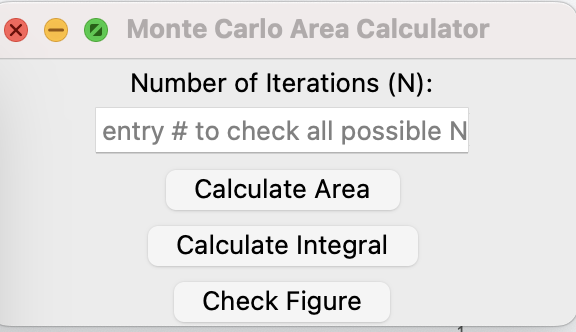
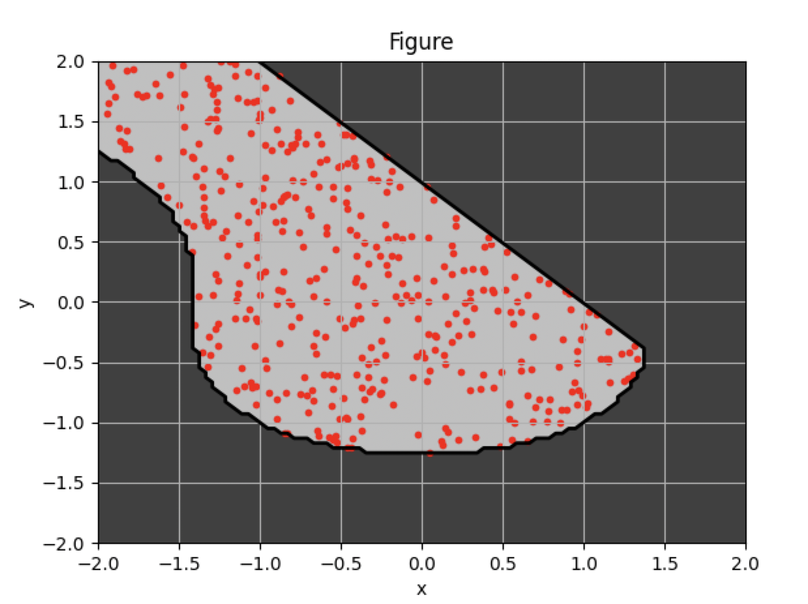

# MonteCarloArea
 Approximate calculation of the area of a figure using Monte Carlo method

## Description
This program approximates the area of a figure using the Monte Carlo method. The figure is defined by the following conditions:
- x^2 - y^3 < 2
- x + y > 1
- 0 < x < 2
- 0 < y < 2

The program also calculates the integral of x^2 from 0 to 2.

## Usage
```python3 ui_entry.py```
**Tested on Python 3.11.9**

## Requirements
- Python 3.9 or higher
- matplotlib
- numpy
- tkinter

## Screenshots
<div align="center">
    
</div>
<div align="center">
    
</div>
